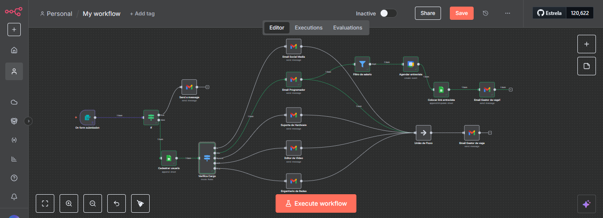
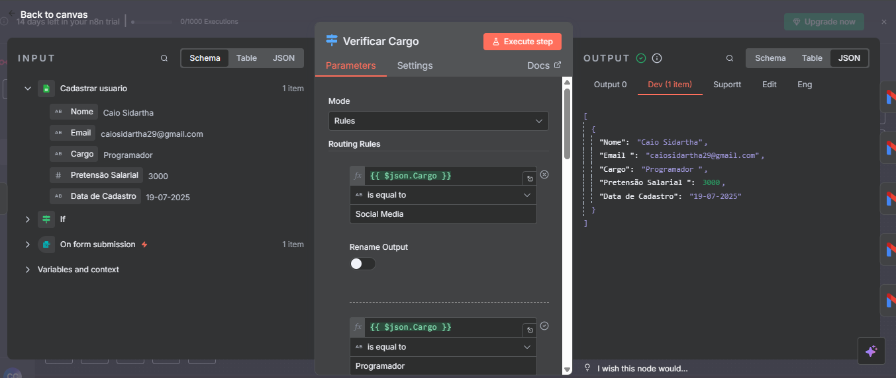
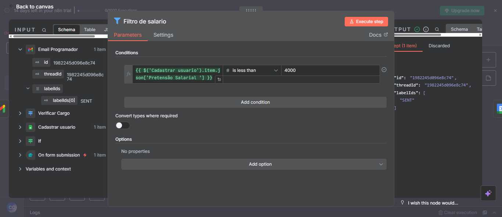
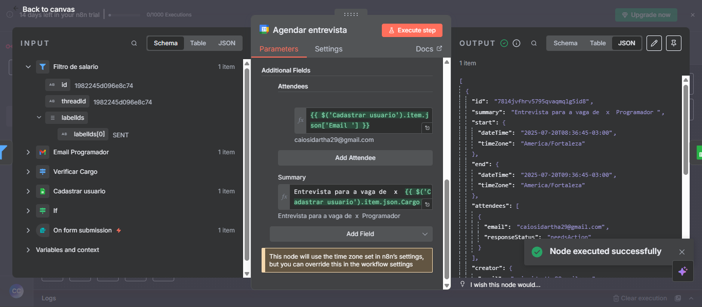

# Automação de Gerenciamento de Candidaturas para Vagas de TI com n8n

## 📝 Descrição do Projeto

Este projeto implementa uma automação inteligente utilizando **n8n** para otimizar e agilizar o processo de gerenciamento de candidaturas a vagas de TI. Ele visa transformar a triagem inicial, que é tradicionalmente manual e demorada, em um fluxo eficiente, integrado e menos propenso a erros, melhorando a experiência tanto para a equipe de RH quanto para os próprios candidatos.

## 🚀 Problemas Resolvidos e Objetivos Alcançados

* **Processamento Manual Lento:** Elimina a necessidade de intervenção humana em tarefas rotineiras, como o envio de dados e a comunicação inicial. Isso acelera drasticamente a fase de triagem, permitindo que a equipe se concentre em atividades mais estratégicas.
* **Redução de Erros Humanos:** Minimiza falhas comuns associadas à digitação e repasse manual de informações, garantindo a integridade e a acurácia dos dados coletados dos candidatos.
* **Falta de Integração entre Sistemas:** Conecta de forma fluida os dados do formulário de candidaturas a serviços essenciais como o **Google Planilhas** para armazenamento e o **Gmail** para comunicação, criando um ecossistema de informações centralizado e automatizado.
* **Retorno Tardio ao Candidato:** Garante respostas automáticas e ações imediatas após o envio da candidatura, oferecendo um feedback rápido e positivo que melhora a experiência do usuário e a percepção da empresa.

## 🛠️ Tecnologias e Ferramentas Utilizadas

* **n8n:** A plataforma de automação de fluxo de trabalho no-code/low-code, essencial para orquestrar todas as etapas do processo.
* **Google Planilhas:** Utilizado como banco de dados para coletar, organizar e armazenar de forma estruturada todas as informações dos candidatos.
* **Gmail:** Empregado para o envio automatizado de e-mails personalizados, como confirmações de recebimento de candidatura e outras comunicações relevantes aos candidatos.

## ⚙️ Funcionalidades e Etapas do Workflow

O fluxo de automação no n8n é construído com as seguintes etapas principais:

1.  **Captura de Dados de Candidatura:** O workflow é acionado ao receber dados de novas candidaturas para vagas de TI (normalmente via webhook de um formulário ou sistema externo).
2.  **Armazenamento no Google Planilhas:** Os dados recebidos são automaticamente formatados e inseridos em uma planilha específica no Google Planilhas, criando um registro organizado de todos os candidatos.
3.  **Validação de Pretensão Salarial:** Uma etapa de validação verifica a pretensão salarial informada pelo candidato, permitindo a criação de lógicas condicionais subsequentes no fluxo (por exemplo, diferentes tipos de e-mails ou categorização).
4.  **Comunicação Automatizada via Gmail:** Após a validação, um e-mail de confirmação ou de follow-up personalizado é enviado ao candidato via Gmail, garantindo que ele receba um retorno rápido sobre sua candidatura.

## 📊 Resultados e Impacto do Projeto

A implementação desta automação trouxe benefícios tangíveis e demonstrou um impacto significativo na eficiência operacional:

* **Economia de Tempo e Carga Horária:** A automação de tarefas administrativas relacionadas a formulários pode levar a uma **redução estimada de até 30% na carga horária semanal** dedicada a essas atividades, liberando recursos humanos para tarefas de maior valor agregado.
* **Melhoria na Comunicação e Experiência do Candidato:** O envio imediato de e-mails de confirmação e o armazenamento organizado dos dados contribuem para uma **comunicação mais eficiente e uma experiência de candidatura superior**, refletindo positivamente na imagem da empresa.
* **Integração de Sistemas Robusta:** O projeto exemplifica a capacidade do n8n de criar **fluxos de trabalho coesos e automatizados** entre diferentes plataformas (formulários, planilhas, e-mail), operando sem a necessidade de intervenção manual constante.

## 📸 Visualização do Workflow

Aqui estão algumas capturas de tela que ilustram a estrutura e a lógica do workflow construído no n8n:

---

### Visão Geral do Workflow no n8n

*Uma visão macro do fluxo de automação de candidaturas, mostrando a interconexão das etapas.*

---

### Detalhe do Nó de Validação e Envio de E-mail

*Um close-up em uma parte específica do workflow, destacando a lógica de validação de dados (como a pretensão salarial) e o nó de envio de e-mail via Gmail.*

### Nó de filtro pretensão salárial para agendar uma entrevista 

*Um close-up em uma parte específica do workflow, destacando a lógica do filtro para o agendamento da entrevista.*

### Nó de Agendamento para entrevista e emprego para o cargo

*Um close-up em uma parte específica do workflow, destacando o agendamento da entrevista com Google Calendar.*
---

## 💡 Desafios e Aprendizados

Um dos principais aprendizados durante o desenvolvimento deste projeto foi a flexibilidade do n8n em lidar com diferentes APIs e requisitos de validação de dados. A configuração precisa dos nós de Google Planilhas e Gmail, bem como a implementação da lógica condicional para a pretensão salarial, foram cruciais para garantir a robustez e a eficiência do fluxo. Este projeto reforçou a capacidade do n8n em transformar processos complexos em soluções automatizadas e intuitivas.
